<!-- Header: artwork generated by the private workspace (scripts/theme/build_theme.py), Savvytex Pro palette -->
<a href="#lets-talk">
  <picture>
    <source media="(prefers-color-scheme: light)" srcset="assets/theme/hero-light.svg"/>
    
  </picture>
</a>

  

  
  
  

  
  
  
  
  

  <a href="#what-i-can-build-for-you"><b>Services</b></a> ·
  <a href="#featured-work"><b>Featured work</b></a> ·
  <a href="#private-work-index"><b>Private work</b></a> ·
  <a href="#engineering-telemetry"><b>Telemetry</b></a> ·
  <a href="#case-studies"><b>Case studies</b></a> ·
  <a href="#experience"><b>Experience</b></a> ·
  <a href="#tech-stack"><b>Tech stack</b></a> ·
  <a href="#lets-talk"><b>Contact</b></a>

<table>
  <tr>
    <td width="38%" valign="top">
      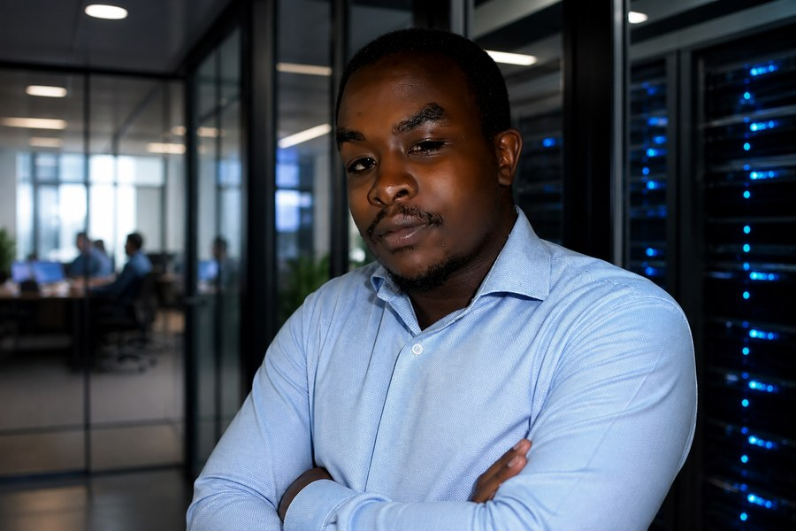
    </td>
    <td width="62%" valign="top">
      <h2>Hi, I'm Felix 👋</h2>
      

        I'm an <b>Electrical &amp; Electronic Engineer</b> and <b>founder of Savvytex Marines Ltd</b>. For more than ten years I've built systems where software, networks and hardware all have to work together, in production, on real sites.
      

      

        One week I'm writing a Django API and an Electron desktop client; the next I'm configuring a dual-WAN MikroTik gateway or debugging STM32 firmware on a battery management board. Clients hire me because <b>one engineer can own the whole problem</b>, from the circuit board to the cloud dashboard.
      

      

        <b>I work remotely with clients anywhere in the world.</b> UTC+3 gives a full working-day overlap with Europe and the Middle East, and morning overlap with the US East Coast.
      

    </td>
  </tr>
</table>

<picture>
  <source media="(prefers-color-scheme: light)" srcset="assets/theme/stats-light.svg"/>
  
</picture>

<b>── SERVICES</b>

## What I can build for you

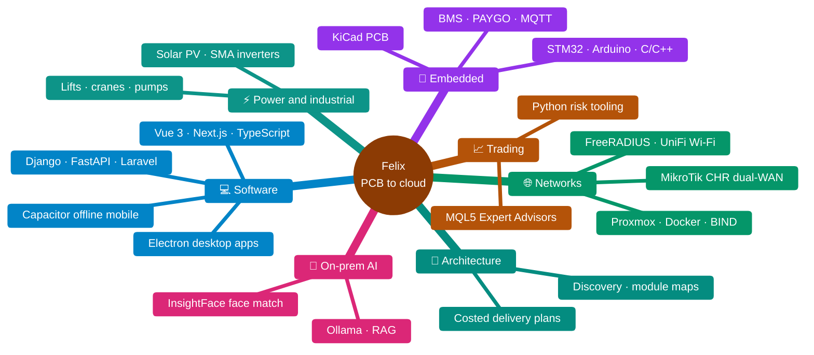

| Service | What you get | Typical stack |
|---|---|---|
| **Web platforms and SaaS** | Multi-tenant APIs, admin dashboards, CMS, payments, real-time features | Django REST, Laravel, Node, Next.js, Vue 3, PostgreSQL, Redis, Stripe |
| **Desktop and mobile apps** | Cross-platform installers for Windows, macOS and Linux; offline-first Android/iOS apps with sync | Electron, Vue, TypeScript, Capacitor |
| **Self-hosted AI** | Private LLM assistants, retrieval-augmented search over your documents, face verification, all running on your own hardware | FastAPI, Ollama, ONNX Runtime, InsightFace, OpenCV |
| **Network and infrastructure** | Campus or office networks: dual-WAN failover, identity-based Wi-Fi, VLAN separation, virtualised servers, self-hosted mail and video | MikroTik RouterOS/CHR, FreeRADIUS, UniFi, Proxmox, Docker, BIND, Mailcow, Jitsi |
| **Embedded and IoT** | Firmware, sensor telemetry to the cloud, device dashboards, pay-as-you-go hardware | C/C++, STM32, Arduino, Raspberry Pi, MQTT, KiCad |
| **Trading systems** | Rule-based MT5 Expert Advisors with strict risk controls, backtesting and monitoring tools | MQL5, Python, pandas |
| **Solution architecture** | Discovery workshops, system design, module maps and costed delivery plans before any code is written | Mermaid / C4-style diagrams, technical breakdowns, BOQs |

<b>── SELECTED WORK</b>

## Featured work

### 🏫 Flagship: AEMMS, an education management platform

AEMMS is a full ecosystem I designed and built for teacher-training and TVET (technical and vocational) colleges. Staff author, mark, and release exams on a desktop app; trainees sit exams on a locked-down desktop client; supervisors assess teaching practice and industrial attachment from a mobile app that works offline; and an on-campus AI service handles face verification and learning assistance. It's all tied together by a Django API and licensed from a central vendor server.

  
  
  
  
  

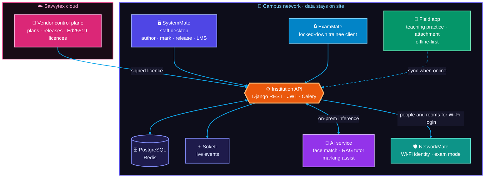

**One exam, end to end:**

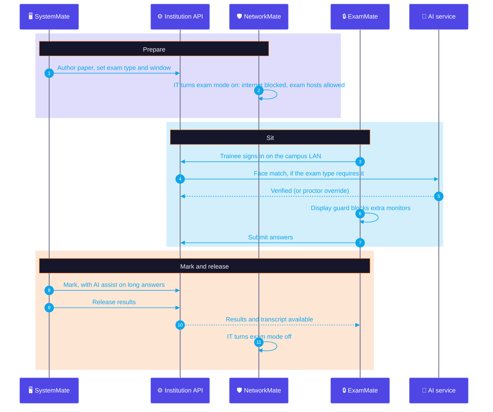

<table>
<tr>
<td width="33%" valign="top">

**🖥️ SystemMate** 
STAFF · HODS · REGISTRAR · KNEC + CDACC

Exam authoring with maths, marking and release; LMS with syllabus, schemes of work, notes and live Campus Meet; results and transcripts.

 
   

</td>
<td width="33%" valign="top">

**🔒 ExamMate** 
TRAINEES · KNEC + CDACC

Locked-down exam sitting with a display guard and site blocking, face check when the exam type needs it; lessons and results.

 
  

</td>
<td width="33%" valign="top">

**⚙️ Institution API** 
EVERY APP

Multi-tenant REST API: JWT auth, per-exam-type proctoring policy, real-time events, device workers.

 
   

</td>
</tr>
<tr>
<td width="33%" valign="top">

**📱 Field apps** 
SUPERVISORS · PRACTICUM + ATTACHMENT

Teaching-practice and industrial-attachment visits, rubrics and attendance. Works offline, syncs when back in signal.

 
  

</td>
<td width="33%" valign="top">

**🧠 AI service** 
ON CAMPUS HARDWARE

Face verification, a RAG learning assistant over course material, marking assist and agents. No student data leaves the building.

 
   

</td>
<td width="33%" valign="top">

**🔑 Vendor control plane** 
SAVVYTEX

Plans, subscriptions, releases and Ed25519-signed licence files that campuses verify offline.

 
 

</td>
</tr>
</table>

<!-- telemetry:aemms -->
**AEMMS by the numbers**

<picture>
  <source media="(prefers-color-scheme: light)" srcset="assets/theme/aemms-stats-light.svg"/>
  
</picture>

  

<picture>
  <source media="(prefers-color-scheme: light)" srcset="assets/theme/aemms-donuts-light.svg"/>
  
</picture>

Measured from git on 2026-09-27 by <code>telemetry.py</code>: tracked files only, non-blank lines, CDACC forks counted once; dependencies, builds, migrations and third-party themes excluded.
<!-- /telemetry:aemms -->

➡️ **[Read the AEMMS case study](case-studies/aemms-platform.md)** · **[See screenshots in the showcase repo](https://github.com/flowser/aemms-showcase)**

### 🌐 Live campus network build: Chesta Teachers Training College (2026)

Lead engineer for a full production deployment at a college in West Pokot, Kenya:

- **Dual-WAN resilience:** Starlink primary with Airtel failover, so the campus stays online through an ISP outage.
- **Identity-based Wi-Fi:** FreeRADIUS and UniFi, with every student logging in with their own credentials instead of a shared password.
- **Exam lockdown:** during exams, student internet is blocked except for approved exam servers, device limits are enforced, and staff networks stay online.
- **Self-hosted services:** the AEMMS platform, Mailcow email and Jitsi video conferencing, all running on Proxmox.
- **NetworkMate control room:** a web portal that lets the IT team manage students, devices and exam mode without touching router configs.
- **Full handover:** equipment inventory and operations runbooks for the client's own team.

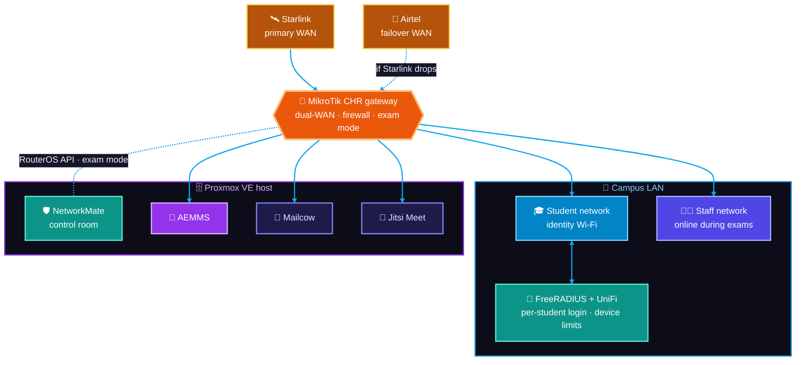

➡️ **[Read the campus network case study](case-studies/chesta-campus-network.md)**

### 🔌 Industrial, embedded and field engineering

Firmware, electronics and cloud in one closed loop. This is the pattern behind the PAYGO e-bike and e-mobility battery-management projects:

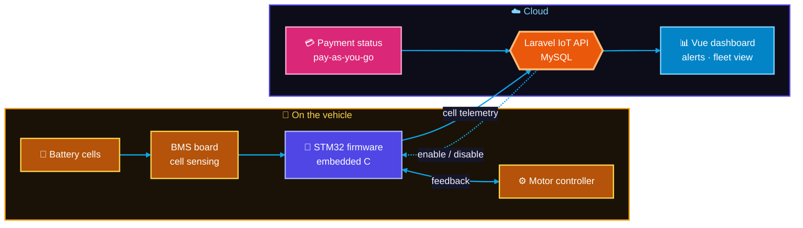

<table>
  <tr>
    <td width="50%" valign="top">
      <b>PAYGO e-bikes and battery management</b> 
      STM32 firmware in embedded C, with a Laravel/Vue IoT backend. Battery cell telemetry streams to the cloud with alerts and motor-controller feedback.
    </td>
    <td width="50%" valign="top">
      <b>Ventilator reverse engineering</b> 
      A low-cost mechanical ventilator prototype with remote-monitoring web UI, plus real-time temperature and pressure firmware for medical equipment.
    </td>
  </tr>
  <tr>
    <td width="50%" valign="top">
      <b>Smart home control</b> 
      Arduino, Raspberry Pi, Django, Android and MQTT, running in a real home.
    </td>
    <td width="50%" valign="top">
      <b>Solar PV and power systems</b> 
      SMA inverter commissioning, control-PCB troubleshooting, UPS, generators, pumps and RO water systems.
    </td>
  </tr>
  <tr>
    <td width="50%" valign="top">
      <b>Lifts, cranes and medical equipment</b> 
      Lift LED displays, industrial motherboards, escalator reprogramming, overhead cranes, and autonomous dental-chair hydraulics.
    </td>
    <td width="50%" valign="top">
      <b>Vending and M-Pesa</b> 
      Vending machine controllers with mobile-money payment integration.
    </td>
  </tr>
</table>

➡️ **[Read the embedded and IoT case study](case-studies/embedded-and-iot.md)**

<b>── PRIVATE PORTFOLIO</b>

## Private work index

Most of what I build is client or product IP, so the source is private. This is the full list; I'm happy to demo any of it on a call.

<table>
  <tr><th colspan="3" align="left">🎓 Education, exams and campus software</th></tr>
  <tr><td width="26%"><b><a href="#-flagship-aemms-an-education-management-platform">AEMMS platform</a></b></td><td>Education management and exam system: staff desktop, locked-down exam client, offline field app, institution API, on-prem AI, vendor licensing</td><td width="28%">Django · Electron · Vue 3 · Capacitor · FastAPI</td></tr>
  <tr><td><b>Exam server (2025)</b></td><td>Earlier exam backend with queue workers and schedulers</td><td>Laravel · TypeScript · Docker</td></tr>
  <tr><td><b>VoteMate</b></td><td>Campus election platform: voter registers, ballots and live results over WebSockets, as one Docker stack</td><td>Django · Vue 3 · PostgreSQL · Redis · Soketi</td></tr>
  <tr><td><b>Research survey platform</b></td><td>Self-hosted SurveyMonkey alternative with validated Likert instruments, deadlines, analytics and Excel export</td><td>Laravel · Vue · MySQL</td></tr>
  <tr><td><b>Institutional IT</b></td><td>Active Directory and Group Policy rollout, admissions web app, library database, notice and tender portals, desktop-to-SMS integration</td><td>Windows Server · web apps</td></tr>

  <tr><th colspan="3" align="left">🌐 Networks and infrastructure</th></tr>
  <tr><td><b><a href="https://github.com/flowser/networkmate-showcase">NetworkMate</a></b></td><td>Campus network control room: identity Wi-Fi, device control, one-click exam lockdown</td><td>Django · Vue 3 · MikroTik API · FreeRADIUS</td></tr>
  <tr><td><b><a href="#-live-campus-network-build-chesta-teachers-training-college-2026">Chesta campus stack</a></b></td><td>Dual-WAN, RADIUS + UniFi identity Wi-Fi, exam lockdown, self-hosted mail and video, full handover runbooks</td><td>MikroTik CHR · Proxmox · Mailcow · Jitsi</td></tr>
  <tr><td><b>Campus AI Lab</b></td><td>Browser console for testing self-hosted LLMs and agents with a model picker, running on Proxmox</td><td>Vue 3 · Ollama · FastAPI</td></tr>

  <tr><th colspan="3" align="left">🏢 Business platforms and SaaS</th></tr>
  <tr><td><b>Savvytex platform</b></td><td>Company API and website: CMS-driven public site, staff operations console, portfolio, social publishing, field sync ledger and vendor licensing</td><td>Django · Vue 3 · TypeScript · PostgreSQL</td></tr>
  <tr><td><b>upgo insurance platform</b></td><td>Customer-facing insurance agency platform with online payments</td><td>Next.js · React · Node.js · MySQL · Stripe</td></tr>
  <tr><td><b>Nyumbané</b></td><td>Household budgeting product shipped as four clients (web, desktop, iOS, Android) on one API</td><td>Django · Electron · Capacitor</td></tr>
  <tr><td><b>Industrial services marketplace</b></td><td>CMS where industrial clients post technical problems for engineers to solve</td><td>Web CMS</td></tr>

  <tr><th colspan="3" align="left">💳 Fintech and trading</th></tr>
  <tr><td><b><a href="https://github.com/flowser/trademate-showcase">TradeMate</a></b></td><td>Risk-first MT5 Expert Advisor and Python monitoring app for 8 assets: six filter layers, daily loss halt, no martingale</td><td>MQL5 · Python · pandas</td></tr>
  <tr><td><b>Vending and M-Pesa</b></td><td>Vending machine controllers with mobile-money payment integration</td><td>Embedded controllers · M-Pesa</td></tr>

  <tr><th colspan="3" align="left">🔌 Embedded, IoT and hardware</th></tr>
  <tr><td><b>PAYGO e-bike</b></td><td>Pay-as-you-go e-mobility: STM32 firmware with a cloud payment-status loop</td><td>STM32 · embedded C · Laravel · Vue</td></tr>
  <tr><td><b>E-mobility BMS</b></td><td>Battery cell telemetry to the cloud with web alerts and motor-controller feedback</td><td>Firmware · MySQL · web UI</td></tr>
  <tr><td><b>Smart home</b></td><td>Home automation running in a real home, with an Android app</td><td>Arduino · Raspberry Pi · Django · MQTT</td></tr>
  <tr><td><b>Ventilator prototype</b></td><td>Low-cost mechanical ventilator reverse-engineered with remote monitoring, plus real-time temperature and pressure firmware for medical equipment</td><td>Firmware · web UI</td></tr>
  <tr><td><b>Field engineering</b></td><td>SMA inverter commissioning, control-PCB repair, lift and escalator electronics, overhead cranes, pumps, RO plants, dental-chair hydraulics</td><td>Power electronics · PLC · diagnostics</td></tr>

  <tr><th colspan="3" align="left">🧭 Solution architecture</th></tr>
  <tr><td><b>Intelligent maize milling platform</b> (proposal)</td><td>End-to-end design for a milling business: weighbridge intake, production and yield, warehouses, sales, KRA e-invoicing, M-Pesa reconciliation, offline field sync and an AI roadmap. Delivered as a technical breakdown, module maps and costed packages</td><td>Architecture · Mermaid · BOQ</td></tr>
</table>

<b>── BY THE NUMBERS</b>

## Engineering telemetry

Most of my code is private, so GitHub's public graphs miss it. These charts are measured straight from the private repos.

<!-- telemetry:portfolio -->
<picture>
  <source media="(prefers-color-scheme: light)" srcset="assets/theme/telemetry-stats-light.svg"/>
  
</picture>

**Every line by language**

<picture>
  <source media="(prefers-color-scheme: light)" srcset="assets/theme/languages-light.svg"/>
  
</picture>

**Commits per month in 2026** (bars: all products · line: AEMMS · September to date)

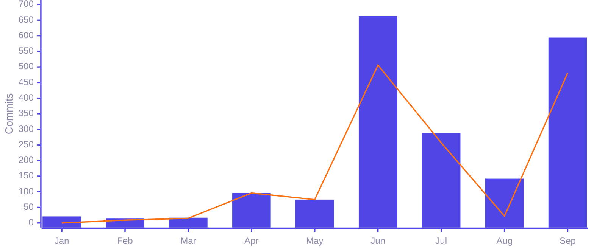

**Where the code lives: product by language**

<picture>
  <source media="(prefers-color-scheme: light)" srcset="assets/theme/products-light.svg"/>
  
</picture>

<picture>
  <source media="(prefers-color-scheme: light)" srcset="assets/theme/portfolio-donuts-light.svg"/>
  
</picture>

- **1.03M lines** across six products, almost all written in the last ten months.
- **1,461 commits** on AEMMS alone: 686 API routes and 145 data models behind 441 screens and components.
- **873 automated tests** and 13 CI workflows guard releases.
- **Full stack in one head:** Python back ends, TypeScript/Vue front ends, MQL5 trading code and PHP legacy systems, plus the networks and hardware they run on.

Measured from git on 2026-09-27 with <code>telemetry.py</code>. Private repos only; tracked files, non-blank lines; CDACC forks counted once; dependencies, builds, migrations and third-party themes excluded.
<!-- /telemetry:portfolio -->

<b>── DEEP DIVES</b>

## Case studies

<table>
  <tr>
    <td width="33%" valign="top">
      <h4><a href="case-studies/aemms-platform.md">🏫 AEMMS platform</a></h4>
      Architecture and decisions behind a campus-owned education platform: signed offline licensing, self-hosted real-time, on-prem AI.
    </td>
    <td width="33%" valign="top">
      <h4><a href="case-studies/chesta-campus-network.md">🌐 Campus network</a></h4>
      Dual-WAN failover, identity Wi-Fi, exam lockdown and self-hosted services for a rural college.
    </td>
    <td width="33%" valign="top">
      <h4><a href="case-studies/embedded-and-iot.md">🔌 Embedded and IoT</a></h4>
      PAYGO e-bike firmware, battery telemetry, a ventilator prototype, smart home and industrial field work.
    </td>
  </tr>
</table>

**Product showcases** with screenshots, architecture and engineering notes (source code stays private):

  
  
  

<b>── TRACK RECORD</b>

## Experience

Over ten years I've owned systems end to end, from the circuit board to the cloud and from the first diagram to the handover binder.

**What you get when you hire me**

<table>
<tr>
<td width="25%" valign="top">

**🎯 One accountable engineer** 
OWNERSHIP

Architecture, build, deployment and handover across software, networks and hardware. You don't have to coordinate three vendors.

</td>
<td width="25%" valign="top">

**🛡️ Built for bad days** 
RESILIENCE

Dual internet links, offline-first mobile apps, and an exam lockdown that keeps the admin office online. Things keep running when one part fails.

</td>
<td width="25%" valign="top">

**📦 Handover, not lock-in** 
OPERABILITY

Every deployment ships with an inventory and runbooks your own team can follow. The software runs on your servers, under a signed licence.

</td>
<td width="25%" valign="top">

**⚡ Ships at pace** 
DELIVERY

1,989 commits across six products in 2026. AEMMS went from its first commit in February to a live campus the same year.

</td>
</tr>
</table>

**Roles**

 &nbsp;<b>FOUNDER · FULL TIME</b>

### 🏢 Founder and Lead Engineer · Savvytex Marines Ltd
NAIROBI · REMOTE-READY · PRODUCT, ARCHITECTURE AND DELIVERY

I set product direction and lead the engineering for everything the company ships.

- **Designed AEMMS:** 10 codebases and 6 apps, in two regulator editions (KNEC and CDACC) on one shared architecture.
- **Set the business model:** customers subscribe, but the system runs on the campus's own servers. Ed25519-signed licences control modules, seats and expiry.
- **Built the product line:** NetworkMate (campus network control), the Savvytex company platform (website, operations, social publishing, licensing), VoteMate and TradeMate.
- **Wrote the code:** 1.03M lines and 1,989 commits across 16 private repositories (measured, see [telemetry](#engineering-telemetry)).
- **Design solutions with the client:** I work directly with college principals on local-network exams, named-user Wi-Fi and exam-week operations.

     

 &nbsp;<b>FLAGSHIP DEPLOYMENT</b>

### 🏫 Lead Engineer · Chesta Teachers Training College
PRODUCTION CAMPUS STACK · TEACHING, ADMINISTRATION AND NATIONAL EXAM WEEKS

| Problem | What I built | Result |
|---|---|---|
| A single internet provider was a single point of failure | Starlink primary with Airtel failover on MikroTik | Teaching and admin stay online when one provider drops |
| Shared Wi-Fi passwords, no idea who is online | FreeRADIUS + UniFi login with each trainee's assessment number, whole roster imported, device limits | A named user for every device |
| Exams need the internet shut for students, not for the office | Separate student and staff networks, plus a gateway exam mode that allows only KNEC and SABE exam hosts | Exam lockdown with one switch, and administration keeps working |
| Exams and results had to run on campus, not in someone else's cloud | AEMMS on campus with release control and transcripts; SystemMate and ExamMate clients | Exams, marking and results run on the campus's own hardware |
| The college needed email and video meetings it controls | Self-hosted Mailcow mail and Jitsi video, NetworkMate ops portal, all on Proxmox | Communication the college owns |

Handed over with an inventory for the principal and operations cookbooks for IT staff. Next phase: a fibre modernisation proposal with a bill of quantities (proposed, not built).

     

 &nbsp;<b>FREELANCE · CLIENT PROJECTS</b>

### 🛠️ Full-Stack, Firmware and Electronics Engineer · Freelance
INSURANCE · MOBILITY · SMART HOME · RETAIL · INDUSTRIAL

- **Insurance agency platform:** React / Next.js front end, Node and MySQL back end, Stripe payments.
- **Pay-as-you-go e-bikes:** STM32 firmware in embedded C, plus a Laravel / Vue IoT backend that tracks payment status.
- **Smart home control:** Arduino and Raspberry Pi devices, a Django server and an Android app, connected over MQTT and used day to day in a lived-in home.
- **Vending with M-Pesa:** mobile-money payment modules for vending machines.
- **Diagnostics and repair:** dental-chair automation, lift and escalator electronics, motherboards and appliances, plus a marketplace website where industrial clients post technical problems.

      

 &nbsp;<b>CONTRACTS · 5 CLIENTS</b>

### ⚡ Technical Service Provider · Industrial and Energy Contracts
GAVITON ENTERPRISES · C.P. POWER EA · NEURAL POWER · KONZA ELEVATORS · LATENIGHT DENTIST

- **E-mobility battery management:** cell data sent to the cloud (MySQL), a web dashboard with alerts, and feedback to the motor controller.
- **Solar and power:** commissioned SMA inverters, fixed faults on control boards, and built spare-parts inventory systems.
- **Heavy plant:** motors, relays, overhead cranes, borehole and dosing pumps, generators and reverse-osmosis water systems.
- **Lifts and escalators:** lift LED displays and industrial motherboards, and escalators reprogrammed on live sites under time pressure.

    

**Engineering track record:**

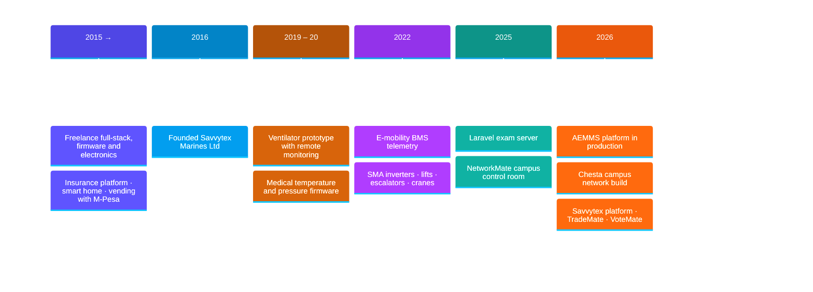

## Credentials

- **Bachelor of Engineering, Electrical & Electronic Engineering**
- Huawei ISP Implementation certification
- Communications Authority of Kenya (CAK) licence
- Engineering Technology professional certification · IETTK certification

<b>── TOOLBOX</b>

## Tech stack

  
   
  
   
  

  
  
  
  
  
  
  
  
  
  
  
  
  

<b>── PROCESS</b>

## How we'd work together

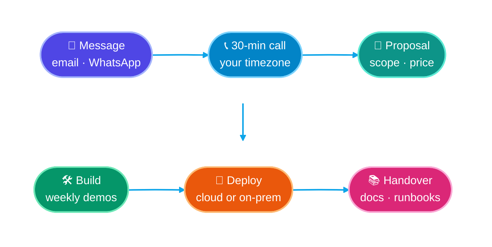

1. **Message me** by email or WhatsApp with a short description of what you need.
2. **30-minute discovery call** on Google Meet, Zoom or WhatsApp, at a time that suits your timezone.
3. **Written proposal** with scope, milestones, timeline and a fixed price or monthly retainer.
4. **Build in the open:** a private repo you own, weekly demos, and progress you can see.
5. **Handover:** documentation, deployment runbooks and post-launch support.

I'm open to **fixed-scope projects, monthly retainers and long-term remote roles** (contract or full-time).

<b>── ACTIVITY</b>

## GitHub activity

  

  

<!-- WORKFLOW-IMAGES -->

Most of my work lives in private client and product repositories, so public stats show only part of it. Happy to walk you through the code on a call.

<b>── CONTACT</b>

## Let's talk

<table>
  <tr>
    <td width="68%" valign="top">
      
<b>Have a project, a role, or just a question?</b> Reach me any way you like.

      

        📧 <b>Email:</b> <a href="mailto:eng.felixnyachio@gmail.com?subject=Project%20inquiry%20from%20GitHub">eng.felixnyachio@gmail.com</a> 
        📱 <b>Phone / WhatsApp:</b> <a href="https://wa.me/254748650011">+254 748 650 011</a> 
        📅 <b>Book a call:</b> <a href="mailto:eng.felixnyachio@gmail.com?subject=Call%20request%20from%20GitHub&body=Hi%20Felix%2C%0A%0AI%27d%20like%20to%20book%20a%20call.%0A%0AProject%20summary%3A%20%0APreferred%20date%2Ftime%20(with%20timezone)%3A%20%0APreferred%20platform%20(Meet%20%2F%20Zoom%20%2F%20WhatsApp)%3A%20%0A">send a call request</a> with your preferred time and timezone 
        📇 <b>Save my contact:</b> <a href="https://github.com/flowser/flowser/raw/main/felix-nyachio.vcf">download vCard</a>, or scan the QR code 
        🌍 <b>Location:</b> Nairobi, Kenya · UTC+3 · remote worldwide
      

      

        
        
      

    </td>
    <td width="32%" align="center" valign="middle">
      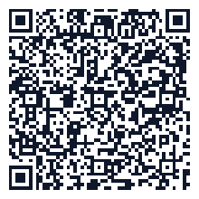 
      Scan to save my contact
    </td>
  </tr>
</table>

<a href="mailto:eng.felixnyachio@gmail.com?subject=Project%20inquiry%20from%20GitHub">
  <picture>
    <source media="(prefers-color-scheme: light)" srcset="assets/theme/footer-light.svg"/>
    
  </picture>
</a>
