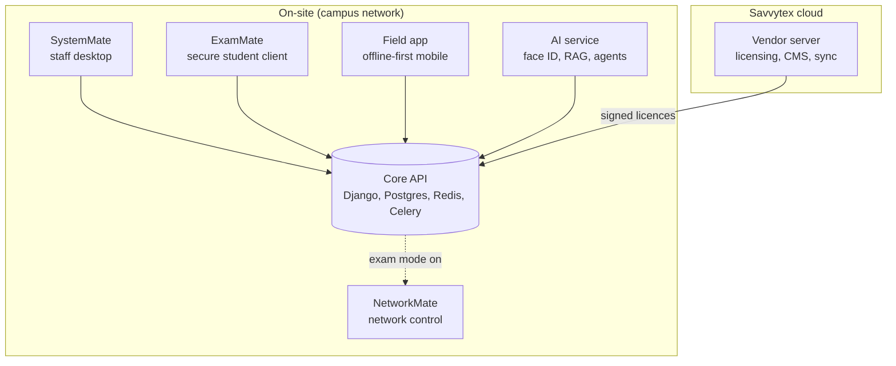

<!-- Header -->

  

  

  
  
  

  
  
  
  
  

  <a href="#what-i-can-build-for-you"><b>Services</b></a> ·
  <a href="#featured-work"><b>Featured work</b></a> ·
  <a href="#case-studies"><b>Case studies</b></a> ·
  <a href="#experience"><b>Experience</b></a> ·
  <a href="#tech-stack"><b>Tech stack</b></a> ·
  <a href="#lets-talk"><b>Contact</b></a>

---

<table>
  <tr>
    <td width="38%" valign="top">
      
    </td>
    <td width="62%" valign="top">
      <h2>Hi, I'm Felix 👋</h2>
      

        I'm an <b>Electrical &amp; Electronic Engineer</b> and <b>founder of Savvytex Marines Ltd</b>. For more than ten years I've built systems where software, networks and hardware all have to work together, in production, on real sites.
      

      

        One week I'm writing a Django API and an Electron desktop client; the next I'm configuring a dual-WAN MikroTik gateway or debugging STM32 firmware on a battery management board. Clients hire me because <b>one engineer can own the whole problem</b>, from the circuit board to the cloud dashboard.
      

      

        <b>I work remotely with clients anywhere in the world.</b> UTC+3 gives a full working-day overlap with Europe and the Middle East, and morning overlap with the US East Coast.
      

    </td>
  </tr>
</table>

<table>
  <tr>
    <td align="center" width="25%"><h2>10+ yrs</h2>shipping engineering projects since 2015</td>
    <td align="center" width="25%"><h2>2,000+</h2>commits across 20+ production repositories</td>
    <td align="center" width="25%"><h2>3 disciplines</h2>software, networking and embedded hardware</td>
    <td align="center" width="25%"><h2>End to end</h2>from architecture and code to deployment and handover</td>
  </tr>
</table>

---

## What I can build for you

| Service | What you get | Typical stack |
|---|---|---|
| **Web platforms and SaaS** | Multi-tenant APIs, admin dashboards, CMS, payments, real-time features | Django REST, Laravel, Node, Next.js, Vue 3, PostgreSQL, Redis, Stripe |
| **Desktop and mobile apps** | Cross-platform installers for Windows, macOS and Linux; offline-first Android/iOS apps with sync | Electron, Vue, TypeScript, Capacitor |
| **Self-hosted AI** | Private LLM assistants, retrieval-augmented search over your documents, face verification, all running on your own hardware | FastAPI, Ollama, ONNX Runtime, InsightFace, OpenCV |
| **Network and infrastructure** | Campus or office networks: dual-WAN failover, identity-based Wi-Fi, VLAN separation, virtualised servers, self-hosted mail and video | MikroTik RouterOS/CHR, FreeRADIUS, UniFi, Proxmox, Docker, BIND, Mailcow, Jitsi |
| **Embedded and IoT** | Firmware, sensor telemetry to the cloud, device dashboards, pay-as-you-go hardware | C/C++, STM32, Arduino, Raspberry Pi, MQTT, KiCad |
| **Trading systems** | Rule-based MT5 Expert Advisors with strict risk controls, backtesting and monitoring tools | MQL5, Python, pandas |

---

## Featured work

### 🏫 AEMMS: a full education management platform (product, in production)

I designed and built **AEMMS**, a complete platform for colleges: a staff desktop app for authoring, marking and releasing exams; a locked-down exam client for students; an offline-first mobile app for field supervision; an on-premises AI service; and a central licensing server. It's deployed on campus hardware and running in production.

**Engineering highlights:** multi-tenant Django REST API with JWT auth, Celery workers and WebSocket events · Electron Forge desktop apps with auto-update and installers for Windows, macOS and Linux · Capacitor mobile app with offline sync · Ed25519-signed licence files · FastAPI AI service with InsightFace and Ollama that keeps all data on-site · Docker locally, Proxmox containers in production.

➡️ **[Read the AEMMS case study](case-studies/aemms-platform.md)**

### 🌐 Live campus network build: Chesta Teachers Training College (2026)

Lead engineer for a full production deployment at a college in West Pokot, Kenya:

- **Dual-WAN resilience:** Starlink primary with Airtel failover, so the campus stays online through an ISP outage.
- **Identity-based Wi-Fi:** FreeRADIUS and UniFi, with every student logging in with their own credentials instead of a shared password.
- **Exam lockdown:** during exams, student internet is blocked except for approved exam servers, device limits are enforced, and staff networks stay online.
- **Self-hosted services:** the AEMMS platform, Mailcow email and Jitsi video conferencing, all running on Proxmox.
- **NetworkMate control room:** a web portal that lets the IT team manage students, devices and exam mode without touching router configs.
- **Full handover:** equipment inventory and operations runbooks for the client's own team.

➡️ **[Read the campus network case study](case-studies/chesta-campus-network.md)**

### 🔌 Industrial, embedded and field engineering

<table>
  <tr>
    <td width="50%" valign="top">
      <b>PAYGO e-bikes and battery management</b> 
      STM32 firmware in embedded C, with a Laravel/Vue IoT backend. Battery cell telemetry streams to the cloud with alerts and motor-controller feedback.
    </td>
    <td width="50%" valign="top">
      <b>Ventilator reverse engineering</b> 
      A low-cost mechanical ventilator prototype with remote-monitoring web UI, plus real-time temperature and pressure firmware for medical equipment.
    </td>
  </tr>
  <tr>
    <td width="50%" valign="top">
      <b>Smart home control</b> 
      Arduino, Raspberry Pi, Django, Android and MQTT, running in a real home.
    </td>
    <td width="50%" valign="top">
      <b>Solar PV and power systems</b> 
      SMA inverter commissioning, control-PCB troubleshooting, UPS, generators, pumps and RO water systems.
    </td>
  </tr>
  <tr>
    <td width="50%" valign="top">
      <b>Lifts, cranes and medical equipment</b> 
      Lift LED displays, industrial motherboards, escalator reprogramming, overhead cranes, and autonomous dental-chair hydraulics.
    </td>
    <td width="50%" valign="top">
      <b>Vending and M-Pesa</b> 
      Vending machine controllers with mobile-money payment integration.
    </td>
  </tr>
</table>

➡️ **[Read the embedded and IoT case study](case-studies/embedded-and-iot.md)**

### 🧩 More software I've shipped

<table>
  <tr>
    <td width="50%" valign="top">
      <h4>Insurance agency platform (upgo)</h4>
      Customer-facing insurance platform with online payments.  
      
      
      
      
    </td>
    <td width="50%" valign="top">
      <h4>TradeMate</h4>
      MT5 scalping Expert Advisor with a Python monitoring app for 8 assets. Built risk-first: per-trade risk limits, daily loss caps, spread and news filters, no martingale.  
      
      
      
    </td>
  </tr>
  <tr>
    <td width="50%" valign="top">
      <h4>Savvytex platform</h4>
      A CMS-driven company website with a staff operations console for social publishing, portfolios and licensing, plus a certificate-verification service with a full audit log.  
      
      
      
    </td>
    <td width="50%" valign="top">
      <h4>VoteMate</h4>
      Election management with voter registers, ballots and live results over WebSockets, packaged as a self-contained Docker stack.  
      
      
      
      
    </td>
  </tr>
  <tr>
    <td width="50%" valign="top">
      <h4>Nyumbané</h4>
      A household budgeting product shipped as four clients (web, desktop, iOS and Android) on one API.  
      
      
      
    </td>
    <td width="50%" valign="top">
      <h4>Research survey platform</h4>
      A self-hosted alternative to SurveyMonkey with validated Likert instruments, deadlines, analytics and Excel export.  
      
      
      
    </td>
  </tr>
</table>

---

## Case studies

<table>
  <tr>
    <td width="33%" valign="top">
      <h4><a href="case-studies/aemms-platform.md">🏫 AEMMS platform</a></h4>
      Architecture and decisions behind a campus-owned education platform: signed offline licensing, self-hosted real-time, on-prem AI.
    </td>
    <td width="33%" valign="top">
      <h4><a href="case-studies/chesta-campus-network.md">🌐 Campus network</a></h4>
      Dual-WAN failover, identity Wi-Fi, exam lockdown and self-hosted services for a rural college.
    </td>
    <td width="33%" valign="top">
      <h4><a href="case-studies/embedded-and-iot.md">🔌 Embedded and IoT</a></h4>
      PAYGO e-bike firmware, battery telemetry, a ventilator prototype, smart home and industrial field work.
    </td>
  </tr>
</table>

---

## Experience

| When | Role | Highlights |
|---|---|---|
| **2016 – now** | **Founder and Lead Engineer**, Savvytex Marines Ltd | Own product and engineering for the AEMMS platform and campus network systems. Architect, build, deploy and hand over production systems. |
| **2026** | **Lead Engineer**, Chesta Teachers Training College deployment | Dual-WAN, identity Wi-Fi, exam lockdown, AEMMS, self-hosted mail and video, operations runbooks. |
| **2015 – now** | **Freelance Full-Stack, Firmware and Electronics Engineer** | Insurance platform, PAYGO e-bikes, smart home IoT, vending and M-Pesa, industrial diagnostics. |
| **2022** | **Technical Service Provider** for Gaviton Enterprises, C.P. Power EA, Neural Power and Konza Elevators | E-mobility battery management, SMA inverters, lift and escalator electronics, industrial plant. |

## Credentials

- **Bachelor of Engineering, Electrical & Electronic Engineering**
- Huawei ISP Implementation certification
- Communications Authority of Kenya (CAK) licence
- Engineering Technology professional certification · IETTK certification

---

## Tech stack

  
   
  
   
  

  
  
  
  
  
  
  
  
  
  
  
  
  

---

## How we'd work together

1. **Message me** by email or WhatsApp with a short description of what you need.
2. **30-minute discovery call** on Google Meet, Zoom or WhatsApp, at a time that suits your timezone.
3. **Written proposal** with scope, milestones, timeline and a fixed price or monthly retainer.
4. **Build in the open:** a private repo you own, weekly demos, and progress you can see.
5. **Handover:** documentation, deployment runbooks and post-launch support.

I'm open to **fixed-scope projects, monthly retainers and long-term remote roles** (contract or full-time).

---

## GitHub activity

  

  

<!-- WORKFLOW-IMAGES -->

Most of my work lives in private client and product repositories, so public stats show only part of it. Happy to walk you through the code on a call.

---

## Let's talk

<table>
  <tr>
    <td width="68%" valign="top">
      
<b>Have a project, a role, or just a question?</b> Reach me any way you like.

      

        📧 <b>Email:</b> <a href="mailto:eng.felixnyachio@gmail.com?subject=Project%20inquiry%20from%20GitHub">eng.felixnyachio@gmail.com</a> 
        📱 <b>Phone / WhatsApp:</b> <a href="https://wa.me/254748650011">+254 748 650 011</a> 
        📅 <b>Book a call:</b> <a href="mailto:eng.felixnyachio@gmail.com?subject=Call%20request%20from%20GitHub&body=Hi%20Felix%2C%0A%0AI%27d%20like%20to%20book%20a%20call.%0A%0AProject%20summary%3A%20%0APreferred%20date%2Ftime%20(with%20timezone)%3A%20%0APreferred%20platform%20(Meet%20%2F%20Zoom%20%2F%20WhatsApp)%3A%20%0A">send a call request</a> with your preferred time and timezone 
        📇 <b>Save my contact:</b> <a href="https://github.com/flowser/flowser/raw/main/felix-nyachio.vcf">download vCard</a>, or scan the QR code 
        🌍 <b>Location:</b> Nairobi, Kenya · UTC+3 · remote worldwide
      

      

        
        
      

    </td>
    <td width="32%" align="center" valign="middle">
       
      Scan to save my contact
    </td>
  </tr>
</table>

  

