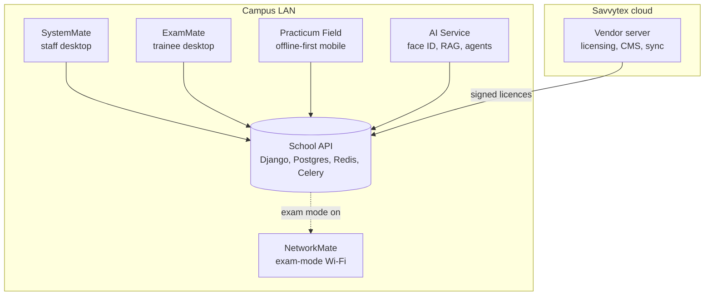

<!-- Header -->

  

  

  
  
  
  

  

---

## About me

I'm an engineer and technical educator in Nairobi. I lead engineering at **Savvytex Marines Ltd**, and I teach Electrical & Telecommunications Engineering at a Kenyan technical training institute. The people I teach are the same people who use my software, which keeps me honest.

Most of my work lives in **private production repositories**. It runs real campuses: exams, marking, lessons, industrial attachment, campus Wi-Fi, and elections, for colleges regulated by both **KNEC** and **CDACC**.

<table>
  <tr>
    <td align="center" width="25%"><h2>2,000+</h2>commits across private production repos</td>
    <td align="center" width="25%"><h2>20+</h2>repositories shipped and maintained</td>
    <td align="center" width="25%"><h2>4</h2>platforms: desktop, web, mobile, on-prem AI</td>
    <td align="center" width="25%"><h2>2</h2>exam regulators served (KNEC and CDACC)</td>
  </tr>
</table>

---

## Flagship: AEMMS, an education management platform

**AEMMS** is a full ecosystem I designed and built for teacher-training and TVET colleges. Staff author, mark, and release exams on a desktop app; trainees sit exams on a locked-down desktop client; supervisors assess teaching practice and industrial attachment from a mobile app that works offline; and an on-campus AI service handles face verification and learning assistance. It's all tied together by a Django API and licensed from a central vendor server.

| Component | What it does | Built with |
|---|---|---|
| **SystemMate** | Staff desktop for lessons, LMS, assessment authoring (with math editing), marking, results release, timetables, and attachment/PoE boards | Electron Forge, Vue 3, TypeScript, Pinia, TanStack Query, CKEditor, FullCalendar |
| **ExamMate** | Trainee desktop for secure exam sitting, lessons, results, and attachment status | Electron, Vue 3, TypeScript, real-time via Soketi |
| **School API** | Multi-tenant institution backend with JWT auth, background jobs, device workers, and real-time events | Django REST Framework, PostgreSQL, Redis, Celery, Nginx, Docker |
| **Practicum Field** | Offline-first mobile app for teaching-practice and industrial-attachment supervision | Capacitor, Vue 3, Android |
| **AI Service** | On-premises AI that never leaves the school network: face verification, retrieval-augmented learning assistant, multi-mode agents | FastAPI, InsightFace, ONNX Runtime, OpenCV, Ollama |
| **Vendor and licensing** | Issues cryptographically signed licence files to each campus deployment | Django, Ed25519 |

Each product ships in two regulator-specific lines (KNEC for teacher-training colleges, CDACC for TVET institutes), deployed on Docker locally and Proxmox on campus.

---

## Other things I've built

<table>
  <tr>
    <td width="50%" valign="top">
      <h3>NetworkMate</h3>
      A control room for school Wi-Fi. Tracks students and their devices, flags unauthorised hardware, and switches the whole campus into <b>exam mode</b> to block cheating. Integrates with MikroTik RouterOS and FreeRADIUS.  
      
      
      
      
    </td>
    <td width="50%" valign="top">
      <h3>TradeMate</h3>
      An MT5 scalping Expert Advisor plus a Python desktop monitor for 8 assets. Built <b>risk-first</b>: percentage risk per trade, daily loss caps, spread gates, news pauses, and strictly no martingale. Every change goes through backtest holdouts before it goes live.  
      
      
      
    </td>
  </tr>
  <tr>
    <td width="50%" valign="top">
      <h3>Savvytex Platform</h3>
      The company's own stack: a CMS-driven public website, a staff operations console (social publishing, learning content, portfolios, licensing), and the API behind it.  
      
      
      
      
    </td>
    <td width="50%" valign="top">
      <h3>VoteMate</h3>
      Campus election management: voter registers, ballots, live results over WebSockets. Runs as a self-contained Docker stack on a campus server.  
      
      
      
      
    </td>
  </tr>
  <tr>
    <td width="50%" valign="top">
      <h3>Nyumbané</h3>
      A household budgeting app for Kenyan families, shipped as four standalone clients (web, desktop, iOS/Android) on one Django API.  
      
      
      
    </td>
    <td width="50%" valign="top">
      <h3>Hardware and infrastructure</h3>
      A home-lab Proxmox server hosting campus services; a USB smart-display host monitor for macOS and Proxmox; IoT water-flow monitoring; and <a href="https://github.com/flowser/bbGesture">bbGesture</a>, a gesture sensor that works through objects.  
      
      
      
    </td>
  </tr>
</table>

I also build research tooling: Bayesian density-estimation simulations (PyMC), survey-data pipelines for postgraduate research, and a generator that turns CDACC curricula into learning plans and session plans for my engineering classes.

---

## Tech stack

  
   
  
   
  

  
  
  
  
  
  
  
  

---

## How I work

- **Ship in small branches.** Feature branch, CI green, merge. Every repo has the same ritual.
- **Docs are part of the product.** Architecture diagrams, runbooks, and operator guides live next to the code.
- **Own the whole stack.** From the MikroTik router and the Proxmox host up to the Vue component the trainee clicks.
- **Keep data on-site.** School AI runs on the campus network, not in someone else's cloud.

---

## GitHub activity

  

  

  

---

## Let's build something

I'm open to EdTech partnerships, school and campus network projects, on-premises AI deployments, and freelance full-stack work.

  
  

  

