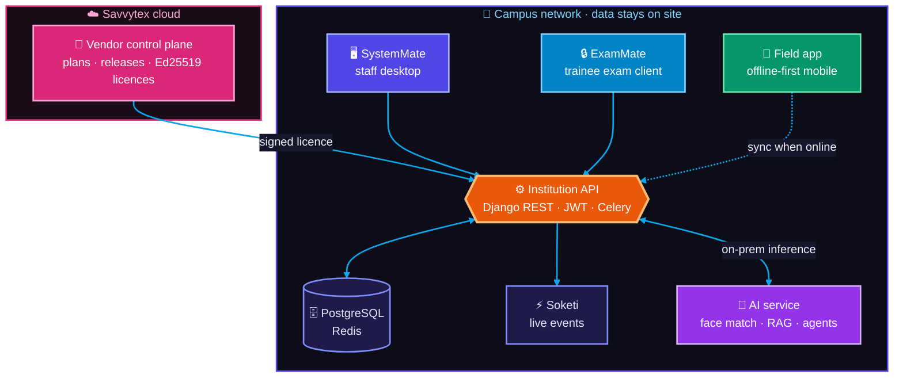
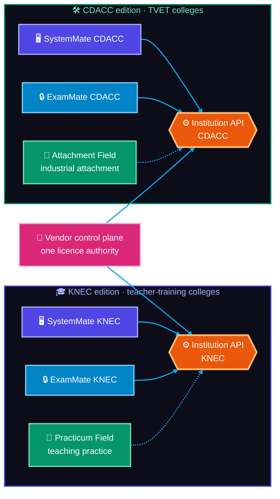
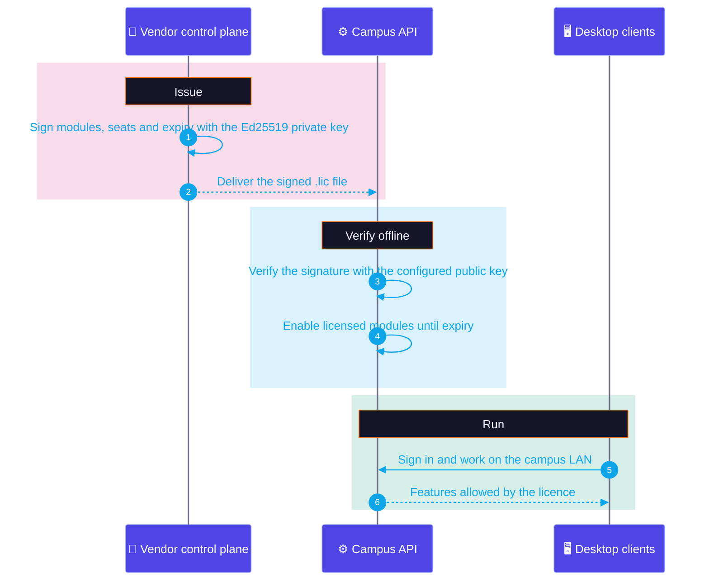
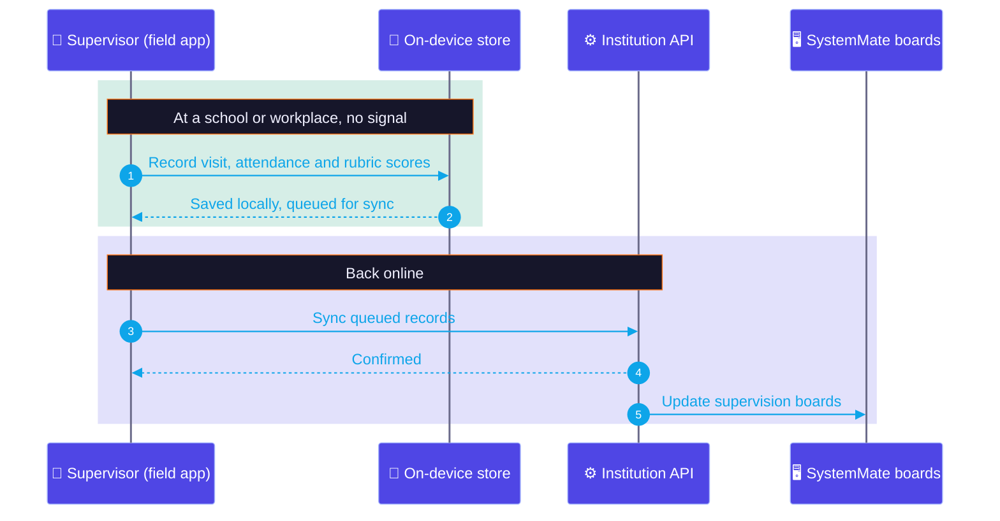

# Case study: AEMMS, an education management platform

**Role:** Founder, architect and lead engineer · **Status:** in production · **Code:** private (walkthrough available on request)

[← Back to profile](https://github.com/flowser)

---

## The problem

Colleges ran exams, marking, results and field supervision on paper, spreadsheets and rented cloud tools. Exam mornings depended on the public internet, student data sat on third-party servers, and every department used a different system.

The client needed **one platform the institution owns**: it runs on campus hardware, keeps working when the internet drops, and handles the full academic cycle from lesson planning to transcripts.

## What I built

A suite of connected products, all designed and built end to end:

| Product | Users | What it does |
|---|---|---|
| **SystemMate** | Staff | Desktop app for lessons, LMS content, assessment authoring (including maths notation), marking, results release, timetables and field-supervision boards |
| **ExamMate** | Students | Locked-down desktop client for sitting exams, reading lessons and viewing results |
| **Field app** | Supervisors | Offline-first mobile app for school visits and industrial-attachment assessment, with rubrics, photos and sync when back online |
| **Core API** | All clients | Multi-tenant institution backend with authentication, background jobs, device workers and real-time events |
| **AI service** | Staff and students | On-premises face verification, retrieval-augmented learning assistant over course material, and task agents |
| **Vendor server** | Savvytex | Issues cryptographically signed licences to each campus deployment; company CMS and sync ledger |

## Architecture

## Two editions, one architecture

AEMMS ships as two editions for two national exam regulators: **KNEC** for teacher-training colleges and **CDACC** for TVET (technical and vocational) colleges. Each edition is its own release line with its own apps and server, so one regulator's rules never leak into the other, while both share the same architecture and licence authority.

## Licensing that works offline

## Field supervision without signal

## Key engineering decisions

- **Campus-owned, commercially SaaS.** Each institution runs its own server on-site; Savvytex issues **Ed25519-signed licence files** that the campus server verifies offline. The business model is subscription, but exams never depend on an external connection.
- **One API, many clients.** Desktop, mobile and AI all speak to the same Django REST API, organised as controllers → repositories → models so each product line stays consistent.
- **Real-time without a SaaS dependency.** WebSocket events are served by a self-hosted Pusher-compatible server (Soketi), so live dashboards work on a closed LAN.
- **AI that never leaves the building.** Face verification (InsightFace on ONNX Runtime) and the learning assistant (Ollama models with retrieval over course material) run on campus hardware. No student data goes to a third-party AI provider.
- **Two regulator editions.** KNEC and CDACC editions share one architecture but ship as separate release lines, so regulator-specific rules stay isolated.
- **Deploy anywhere.** Docker Compose for development; Proxmox containers on campus in production.

## Stack

**Backend:** Python, Django REST Framework, SimpleJWT, PostgreSQL, Redis, Celery, Nginx, Gunicorn, Soketi
**Desktop:** Electron Forge, Vue 3, TypeScript, Pinia, TanStack Query, CKEditor 5, FullCalendar, Tailwind, AdminLTE
**Mobile:** Capacitor, Vue 3, Android
**AI:** FastAPI, InsightFace, ONNX Runtime, OpenCV, Ollama
**Infrastructure:** Docker, Proxmox, GitHub Actions

## Outcome

- Running in production on a college campus (see the [campus network case study](chesta-campus-network.md)).
- Full academic cycle live on campus hardware: authoring, sitting, marking, release and transcripts.
- More than 1,400 commits across the platform's repositories since February 2026.

---

**Need a platform like this built?** [Email me](mailto:eng.felixnyachio@gmail.com?subject=Platform%20project%20inquiry) · [WhatsApp](https://wa.me/254748650011)
