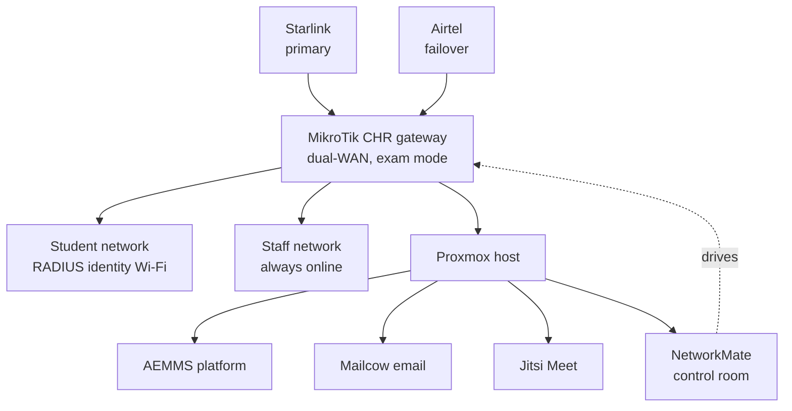

# Case study: production campus network and services

**Client:** Chesta Teachers Training College, West Pokot, Kenya · **Year:** 2026 · **Role:** Lead engineer

[← Back to profile](https://github.com/flowser)

---

## The problem

A rural college needed reliable internet for teaching and administration, a way to lock down the network during national exams without cutting off staff, and its own software platform, all in a location where a single ISP outage used to take the whole campus offline.

## What I delivered

### Resilient connectivity
- **Dual-WAN failover:** Starlink as primary, Airtel as automatic failover, on a virtualised MikroTik router (CHR). Teaching and administration survive a single-ISP failure.
- **Separated networks:** student and staff traffic run on separate network paths, so locking down students during an exam never silences the registrar or the principal's office.
- **Campus DNS** (BIND) for internal services.

### Identity-based Wi-Fi
- **FreeRADIUS and UniFi** enterprise Wi-Fi: every student signs in with their own college credentials, imported from the roster, instead of a shared password.
- Per-user device limits, and the ability to disconnect and re-authenticate users during exam week.

### Exam lockdown
- One switch puts the campus into **exam mode**: student internet is blocked, approved national exam servers stay reachable, device limits are enforced, and staff connectivity is unaffected.

### Self-hosted services on Proxmox
- The **AEMMS** education platform (see the [AEMMS case study](aemms-platform.md)), deployed on campus with desktop clients packaged for the college.
- **Mailcow** email and **Jitsi Meet** video conferencing, hosted on-site.
- **NetworkMate**, a web control room for the IT team to manage students, devices and exam mode without editing router configs.

### Handover
- Equipment inventory and operations runbooks so the college's own team can run and restart everything.
- A fibre modernisation proposal and bill of quantities for the next phase.

## Architecture

## Stack

MikroTik RouterOS / CHR · FreeRADIUS · UniFi OS · Proxmox VE · BIND · Docker · Mailcow · Jitsi · Django · Vue

---

**Need a campus or office network designed and deployed?** [Email me](mailto:eng.felixnyachio@gmail.com?subject=Network%20project%20inquiry) · [WhatsApp](https://wa.me/254748650011)
