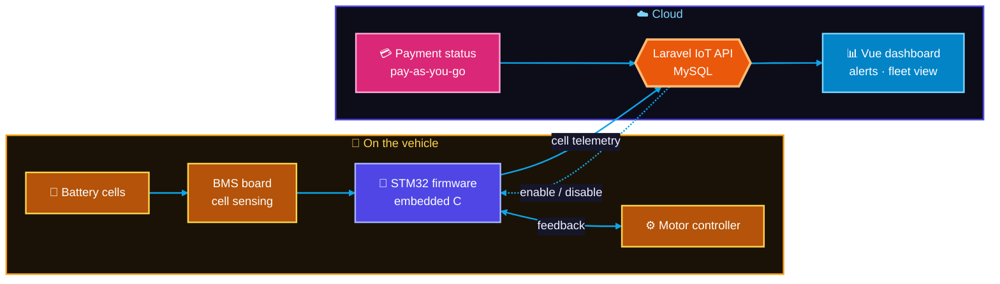
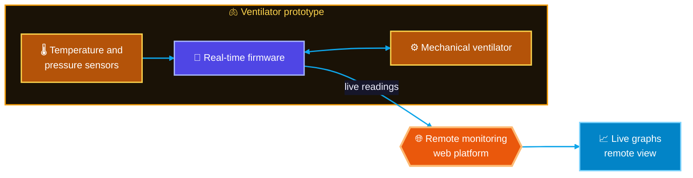
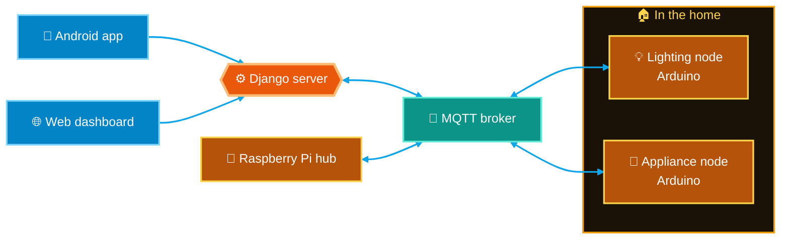

# Case study: embedded, IoT and field engineering

**Role:** Firmware, hardware and full-stack engineer · **Period:** 2015 to now

[← Back to profile](https://github.com/flowser)

---

I'm an Electrical & Electronic Engineer, so a lot of my work starts at the circuit board and ends at a web dashboard. These are some of the projects where hardware, firmware and software had to work together on real sites.

## PAYGO e-bikes and battery management

**Problem:** electric bikes sold on pay-as-you-go plans need to know, in real time, whether the rider has paid, and batteries need protecting from abuse to last their full life.

**What I built:**
- **Firmware** on STM32 in embedded C, controlling the bike according to payment status.
- **Battery management telemetry:** individual cell data streamed to the cloud and stored in MySQL, with alerts and feedback to the motor controller.
- **Backend and dashboard** in Laravel and Vue, showing payment status, battery health and alerts.

**Stack:** STM32 · embedded C · Laravel · Vue · MySQL · IoT

## Ventilator reverse engineering

**Problem:** demonstrate that a low-cost mechanical ventilator is feasible, with remote monitoring.

**What I built:** reverse-engineered a mechanical ventilator and built a remote-monitoring web platform for it, plus firmware for real-time temperature and pressure measurement on medical equipment, with live graphs.

**Stack:** firmware · sensors · web platform · real-time charts

## Smart home control

A home automation system running in a lived-in home: lights and appliances controlled from an Android app and the web, over MQTT.

**Stack:** Arduino · Raspberry Pi · Django · Android · MQTT

## Vending and mobile money

Vending machine controllers integrated with M-Pesa mobile-money payments.

## Power, solar and industrial field service

Contract engineering in 2022 for Gaviton Enterprises, C.P. Power EA, Neural Power, Konza Elevators and Latenight Dentist:

- **Solar and power:** SMA inverter commissioning, control-PCB troubleshooting, UPS systems and generators.
- **Plant:** motors, relays, overhead cranes, borehole and dosing pumps, reverse-osmosis water systems, with spare-parts inventory systems.
- **Vertical transport:** lift LED displays, industrial motherboards and escalator reprogramming on live sites.
- **Medical equipment:** hydraulics and regulator repair on autonomous dental chairs.

## Tools

C / C++ · STM32CubeIDE · Arduino · Raspberry Pi · KiCad (PCB) · PLC · MQTT · SolidWorks · AutoCAD

---

**Need firmware, a connected device or a hardware prototype?** [Email me](mailto:eng.felixnyachio@gmail.com?subject=Embedded%20project%20inquiry) · [WhatsApp](https://wa.me/254748650011)
